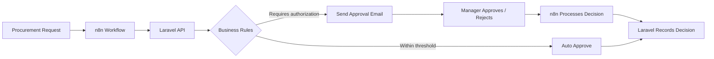

# Procurement Approval Workflow

A procurement approval and business process automation system built with **Laravel and n8n**.

The project demonstrates how a Laravel application can act as the **system of record** while n8n handles workflow orchestration and communication outside the application, including email-based approval decisions.

## Demo

* **Live application:** https://po-approval-n8n-automation.onrender.com
* **Video walkthrough:** https://youtu.be/loz2eEcSAR0
* **Repository:** https://github.com/maxwellmandela/po-approval-n8n-automation

### Demo credentials

```text
Email: johh.doey.123@gmail.com
Password: password
```

> The credentials above are for the public demo environment only.

---

## Workflow Overview

The workflow starts with a procurement request and determines whether it can be approved automatically or requires management approval.



### How it works

1. A procurement request enters the workflow.
2. **n8n** detects and processes the request.
3. n8n sends the relevant request data to the **Laravel API**.
4. Laravel evaluates the request against configured business rules.
5. Requests within the configured threshold can be **automatically approved**.
6. Requests requiring authorization are routed to an approver by **email**.
7. The approver approves or rejects the request through the email workflow.
8. n8n receives and processes the decision.
9. The decision is sent back to Laravel.
10. Laravel records the final approval outcome.

This allows operational processes to continue outside the application while keeping Laravel as the authoritative source for procurement and approval state.

---

## Example Approval Flows

### Automatic Approval

Requests that fall within the configured approval rules can move through the workflow without manual intervention.

```text
Procurement Request
        ↓
       n8n
        ↓
   Laravel API
        ↓
  Approval Rules
        ↓
   Auto-approved
        ↓
Decision recorded
```

### Manager Approval

Requests requiring authorization are routed to an approver.

```text
Procurement Request
        ↓
       n8n
        ↓
   Laravel API
        ↓
 Requires Approval
        ↓
 Approval Email
        ↓
 Approve / Reject
        ↓
       n8n
        ↓
   Laravel API
        ↓
Decision recorded
```

---

## Architecture

The system separates application responsibilities from workflow automation.

| Component       | Responsibility                                                                           |
| --------------- | ---------------------------------------------------------------------------------------- |
| **Laravel**     | Core application, business rules, authentication, procurement records and approval state |
| **Laravel API** | Interface between the application and automation workflows                               |
| **n8n**         | Workflow orchestration, routing, webhooks and external integrations                      |
| **Email**       | Approval and rejection communication with approvers                                      |
| **Database**    | Persistent procurement and approval state                                                |

### Why Laravel + n8n?

Laravel handles the **core business logic and system of record**, while n8n handles the **orchestration and integrations**.

This separation makes it possible to change or extend external workflows without moving core procurement data and business rules into the automation platform.

For example, the email approval step could later be replaced or supplemented with Slack, Microsoft Teams, SMS or another communication channel while Laravel continues to own the procurement state.

---

## Key Features

* Procurement request management
* Authentication and user roles
* Approval threshold logic
* Automatic approval for qualifying requests
* Manager approval workflow
* Email-based approval and rejection
* Webhook communication between Laravel and n8n
* REST API integration
* Persistent approval decisions
* Separation of business logic and workflow orchestration

---

## Technology Stack

* **PHP**
* **Laravel**
* **n8n**
* **MySQL**
* **Blade**
* **REST APIs**
* **Webhooks**
* **Email integration**

---

## Project Structure

```text
.
├── app/                 # Laravel application code
├── database/            # Migrations and database configuration
├── resources/           # Blade views and frontend resources
├── routes/              # Web and API routes
├── n8n/                 # n8n workflow definitions
├── public/              # Public Laravel assets
├── tests/               # Application tests
└── README.md
```

---

## Running Locally

### 1. Clone the repository

```bash
git clone https://github.com/maxwellmandela/po-approval-n8n-automation.git

cd po-approval-n8n-automation
```

### 2. Install PHP dependencies

```bash
composer install
```

### 3. Configure the environment

```bash
cp .env.example .env
```

Generate the application key:

```bash
php artisan key:generate
```

Configure the database and other environment variables in `.env`.

### 4. Run migrations

```bash
php artisan migrate
```

### 5. Start Laravel

```bash
php artisan serve
```

The application will normally be available at:

```text
http://127.0.0.1:8000
```

---

## n8n Setup

The `n8n/` directory contains the workflow definitions used by the project.

To run the automation locally:

1. Start an n8n instance.
2. Import the workflow definitions from the `n8n/` directory.
3. Configure the required credentials and integrations.
4. Configure the Laravel application URL used by the n8n HTTP requests.
5. Configure the webhook endpoints used to send approval decisions back to Laravel.
6. Activate the relevant workflows.

For local development, the Laravel API must be reachable from the n8n instance.

---

## API and Workflow Communication

The Laravel application exposes endpoints used by the automation layer.

The integration follows a simple pattern:

```text
n8n
 ↓
Laravel API
 ↓
Business Rules
 ↓
Procurement State
```

For approval decisions:

```text
Approver
 ↓
Email
 ↓
n8n
 ↓
Laravel API
 ↓
Approval Decision
```

This keeps the workflow layer responsible for orchestration while Laravel remains responsible for the application's persistent state.

---

## Design Considerations

The implementation follows a few core principles:

### Laravel remains the source of truth

Procurement requests and approval decisions are persisted by the Laravel application rather than existing only inside an n8n execution.

### Automation is separated from core business logic

n8n handles workflow orchestration and external communication, while Laravel owns the underlying business rules and application state.

### External communication happens through workflows

The application can trigger operational processes without tightly coupling every external communication channel to the Laravel application.

### Approval decisions are persisted

An approval or rejection becomes part of the procurement record and can be used by the application for subsequent processing.

---

## Potential Extensions

The workflow could be extended to support:

* Multi-level approval chains
* Department-specific approval thresholds
* Vendor onboarding and verification
* Purchase order generation after approval
* Budget availability checks
* Slack or Microsoft Teams notifications
* Approval audit trails
* Approval escalation and reminders
* Role-based approval routing
* Procurement reporting and analytics
* Additional ERP or accounting integrations

---

## Project Purpose

This project was built as a practical demonstration of **full-stack development, API integration and business process automation** using Laravel and n8n.

Rather than building only a traditional CRUD application, the project explores how a Laravel application can integrate with an external automation platform to solve a realistic operational workflow.

The architecture is intentionally small enough to demonstrate the concept while providing a foundation that could be expanded into a larger procurement management system.
